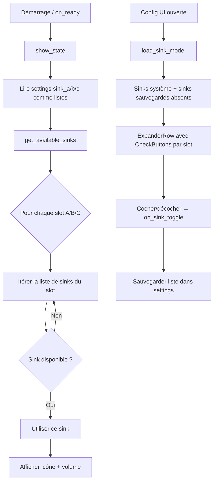

# Design : Multiselect Sink Matching

**Date** : 2026-01-30
**Problème** : Le nom PulseAudio/PipeWire d'un DAC USB peut changer entre les redémarrages (ex: `SAVITECH_Bravo-X` → `Audiophonics_SA9023`). Le plugin matche par nom exact → la config est "perdue" et l'utilisateur doit resélectionner le sink.

## Solution

Transformer le dropdown de sélection de sink (positions A/B/C) en **multiselect**. L'utilisateur peut associer plusieurs noms de sink à un même slot. Au runtime, le premier sink disponible parmi ceux sélectionnés est utilisé.

## Architecture



## Settings

`sink_a`, `sink_b`, `sink_c` passent de `string` à `list[string]`.

Rétro-compatible : le code détecte si la valeur est un string (ancien format) et la traite comme une liste à un élément via `_get_sink_names()`.

## Chargement du modèle de sinks

`load_sink_model()` combine deux sources :

1. **Sinks système** : résultat de `pactl list sinks` (actuellement disponibles)
2. **Sinks sauvegardés** : les noms stockés dans `sink_a`/`sink_b`/`sink_c` qui ne sont PAS dans la liste système

Affichage :
- Sinks disponibles : `"SA9023 USB Audio (alsa_output.usb-Audiophonics...)"`
- Sinks sauvegardés mais absents : `"alsa_output.usb-SAVITECH_Bravo-X... (déconnecté)"`

## UI Multiselect

Remplacement du `ComboRow` (single-select) par un `Adw.ExpanderRow` contenant des `Gtk.CheckButton`.

```
┌─ Output A ──────────────────────────────┐
│ ☑ SA9023 USB Audio (alsa_output.usb...) │
│ ☑ Bravo-X USB Audio (déconnecté)        │
│ ☐ SA9027 USB Audio (alsa_output.usb...) │
│ ☐ AirPods (bluez_output.74_77...)       │
└─────────────────────────────────────────┘
```

Le `ComboRow` pour l'icône reste un single-select.

## Logique de matching au runtime

- **`get_active_sink_index()`** : `current_default IN settings["sink_x"]` (au lieu de `==`)
- **`show_state()` / `on_key_up()`** : Pour chaque slot, itère sa liste de sinks, utilise le premier disponible
- **`on_sink_toggle()`** (nouveau) : Cocher/décocher une checkbox ajoute/retire le sink name de la liste du slot
- **Priorité** : premier sink disponible dans l'ordre de la liste

## Modifications

| Élément | Avant | Après |
|---------|-------|-------|
| Settings `sink_x` | `string` | `list[string]` |
| Sink dropdown | `ComboRow` (single) | `ExpanderRow` + `CheckButton` (multi) |
| `load_sink_model()` | Sinks système uniquement | Système + sauvegardés absents |
| `load_config_settings()` | `set_active(idx)` | Cocher les checkboxes correspondantes |
| `on_sink_change()` | Sauve un string | → `on_sink_toggle()`, sauve une liste |
| `get_active_sink_index()` | `==` exact | `in` liste |
| `show_state()` / `on_key_up()` | Match exact | Premier disponible dans la liste |
| Nouveau | — | `_get_sink_names()` helper rétro-compat |

## Fichiers impactés

- `actions/SwitchAudioAction.py` uniquement
